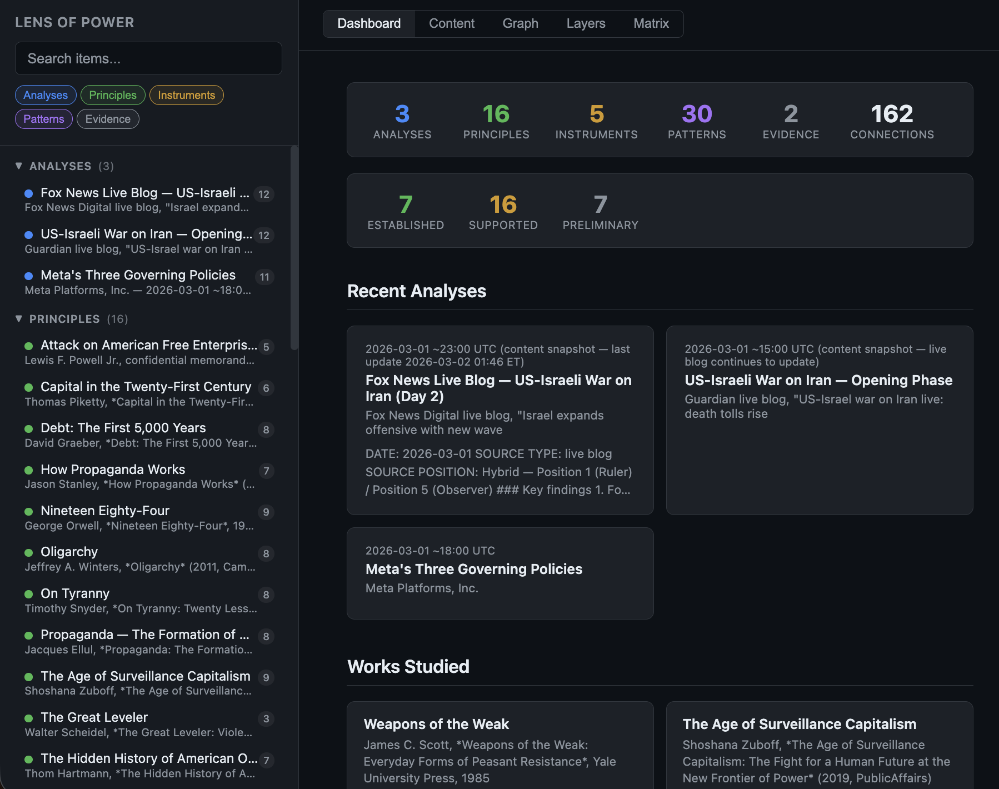

# Lens of Power

An interpretive framework for studying how power and control operate across
layers of society — from language and narrative, through economics and law,
to surveillance and physical force — and understanding how these layers
reinforce each other.

This is a living analytical system. It accumulates knowledge over time
as works are studied and current events are analyzed. It is designed to
be used by both humans and LLMs.

> [!TIP]
> **Quick start**: Navigate to this directory and use the `/lop` skill:
> ```
> /lop analyze [article, event, policy, or URL]
> /lop extract [book, film, theory, reference source, or catalog]
> /lop redteam
> ```
> Works with Claude Code. For other LLMs or manual use, load `constitution.md`,
> `taxonomy.md`, `methodology.md`, and `patterns.md` as context, then follow the
> procedure in `methodology.md`.

## Table of contents

- [What this is for](#what-this-is-for)
- [Core concepts](#core-concepts) — axiom, layer, principle, pattern, instrument, evidence, analysis
- [How to use it](#how-to-use-it)
- [The three modes](#the-three-modes)
  - [Analyze](#lop-analyze--analyze-new-material) — 7-step analysis with briefing output
  - [Extract](#lop-extract--study-a-source-for-principles-and-instruments) — study a source for principles and instruments
  - [Red team](#lop-redteam--turn-the-framework-on-itself) — turn the framework on itself
- [Viewer](#viewer) — interactive visualization of the framework
- [How the framework grows](#how-the-framework-grows)
- [Structure](#structure) — directory layout
- [Integrity constraints](#integrity-constraints) — IC-1 through IC-5
- [Architecture and design patterns](#architecture-and-design-patterns)

## What this is for

Most exercises of power depend on not being seen clearly. Policy is
presented in terms of its stated purpose rather than its function.
Economic structures are presented as natural rather than constructed.
Language is shaped to make certain questions difficult to ask.

The Lens of Power provides a structured method for seeing through these
layers. It is useful for:

- **Analyzing current events**: News coverage, political speeches, policy
  announcements, corporate communications. The framework strips rhetoric
  to expose underlying mechanisms and identifies which layers of power
  are active, which are absent from discussion, and who benefits from the
  framing.
- **Studying foundational works**: Books, films, theories, and historical
  accounts that describe how power operates. The framework extracts
  generalizable principles and adds them to its knowledge base, making
  each subsequent analysis richer.
- **Building analytical tools**: Reference material (taxonomies of logical
  fallacies, catalogs of propaganda techniques, classification systems)
  can be evaluated and imported as instruments — reusable tools applied
  during analysis.
- **Detecting patterns across domains**: The framework's highest-value
  output is the identification of recurring structures of power that
  appear across different eras, cultures, and political systems. A
  mechanism observed in Orwell, confirmed in Machiavelli, and inverted
  by Fanon is more than an academic exercise — it is a pattern that can
  be recognized in tomorrow's news.

The framework includes structural safeguards against becoming a closed
ideological system: every axiom has a falsification condition, every
analysis must consider the non-power explanation, and the framework is
periodically turned on itself through red team reviews.

## Core concepts

The framework is built from seven distinct types of knowledge. Each has a
specific role and a defined relationship to the others.

The seven types: **axiom** (what to look for), **layer** (where to look),
**principle** (what was found in one source), **pattern** (what recurs across
sources), **instrument** (a reusable detection tool), **evidence** (ground
truth), and **analysis** (the output of applying the framework).

### Axiom

A foundational assumption about how power operates. Axioms are the
framework's starting premises — they guide what to look for during
analysis. Each axiom has a **directive** (a question the analyst must ask)
and a **falsification condition** (what evidence would disprove it). Axioms
are not permanent truths; they are the best current model, subject to
revision when evidence warrants it.

There are currently 10 axioms. They live in `constitution.md`.

*Example*: Axiom 3 — "Power is most effective when its contingency is
invisible." Directive: ask what is being presented as natural or inevitable.
Falsification: a system where mechanism, contingency, and capacity to act
are all visible yet the system remains stable without escalating coercion.

### Layer

One of six domains through which power operates simultaneously. Layers are
the framework's **analytical checklist** — every analysis maps which layers
are active, how they interact, and which are conspicuously absent from the
material.

The six layers are: Thought & Narrative, Economic, Legal & Regulatory,
Institutional, Surveillance & Information, Physical & Coercive. They are
defined in `taxonomy.md`.

*Example*: A policy that restricts protest may operate at the Legal &
Regulatory layer (criminalization), the Physical & Coercive layer
(police enforcement), and the Thought & Narrative layer (framing
protesters as threats to public order) — simultaneously.

### Principle

A generalizable truth about how power operates, extracted from a specific
source. A principle states: *this mechanism produces this effect because of
this reason*. Principles are more specific than axioms (they describe
particular mechanisms rather than general properties of power) and more
source-bound than patterns (they may be observed in only one work).

Principles are tagged with taxonomy layers, the source they come from,
and their relationship to existing axioms (confirms, refines, or
contradicts). They live in `principles/`.

*Example*: Machiavelli P5 — "Authority grounded in fear is more durable
than authority grounded in affection, because fear is maintained by the
ruler while affection is controlled by the subject."

**Relationship to patterns**: When a principle is independently confirmed
across multiple sources from different eras or perspectives, it may be
promoted to a pattern.

### Pattern

A recurring structure of power observed across multiple independent
sources, domains, eras, or contexts. Patterns are the framework's
**highest-value output** — they describe mechanisms that repeat despite
different surface forms. The same structural dynamic appearing in Orwell's
fiction, Machiavelli's political theory, and Scott's ethnography is not
a coincidence; it is a pattern.

Patterns have corroboration levels: PRELIMINARY (observed in one context;
may not generalize), SUPPORTED (confirmed across meaningfully independent
contexts), ESTABLISHED (confirmed across multiple independent contexts
with no unresolved counter-evidence). Ratings are qualitative — justified
by the independence and diversity of confirming sources, not by counting
to a threshold. They live in `patterns.md`.

*Example*: The Middle Stratum Trap — "The middle tier of a power hierarchy
is the most heavily controlled because it is the most capable of organizing
resistance, and its marginal privilege prevents downward solidarity."
Observed in Orwell (Outer Party vs. Proles), Machiavelli (the nobles as
the dangerous middle), and Fanon (the national bourgeoisie as relay class).
ESTABLISHED corroboration.

**Relationship to principles**: Patterns emerge from principles. A
principle observed in one source is a finding. The same structural dynamic
confirmed across three independent sources becomes a pattern.

### Instrument

A reusable analytical tool imported from an external source and annotated
with **power-function** descriptions specific to this framework. Instruments
are applied during specific methodology steps to detect mechanisms in
material being analyzed. Every analysis lists which instruments were applied
and what they found.

What distinguishes an instrument from a generic reference document is the
power function field — documenting how each item (a logical fallacy, a
propaganda technique, a control mechanism) functions specifically as a
mechanism of power. They live in `instruments/`.

*Example*: `logical-fallacies.md` — 38 fallacies organized not by formal
classification but by power function: legitimation, deflection, constraint,
emotional override, evidentiary manipulation, burden manipulation. Each
fallacy is annotated with how it operates as a mechanism of control.

**Relationship to analysis**: Instruments are invoked during analysis steps
and listed in the analytical apparatus. Their usage across analyses reveals
which tools are relied on most (and which are neglected — a potential blind
spot).

### Evidence

A concrete fact, data point, documented case, quote, or observation that
grounds the framework in reality. Evidence is **not interpretation** — it
is raw material that supports, challenges, or illustrates axioms and
patterns. Each entry is tagged with the axioms and patterns it relates to
and with its relationship to them (supports / challenges / illustrates).

Evidence lives in `evidence/`.

*Example*: A documented case of a government program named for the opposite
of its function, tagged as supporting Axiom 7 (stated purpose vs. function)
and the Inversion of Stated Purpose pattern.

**Relationship to axioms**: Evidence that challenges an axiom is the most
valuable kind — it tests whether the framework's assumptions hold. IC-1
requires that challenging evidence is never suppressed.

### Analysis

The output of applying the ANALYZE mode to new material. An analysis
consists of **structured working** (the 7 methodology steps) followed by a
**briefing** (human-readable findings with full provenance). Analyses are
snapshots — they capture what was known at a specific point in time and are
never retroactively modified.

Analyses produce **findings** — discrete, tagged conclusions that may
generate new evidence entries, confirm or challenge existing patterns, or
suggest axiom refinements. They live in `analyses/`.

### How the concepts relate

```
Sources ──extract──> Principles ──confirmed across sources──> Patterns
                         │                                        │
                         └──── both tested against ───────────> Axioms
                                                                  │
Evidence ──supports/challenges─────────────────────────────────────┘

Instruments ──applied during──> Analyses ──produce──> Findings
                                   │                      │
                                   │                      ├──> new Evidence
                                   │                      ├──> new/updated Patterns
                                   │                      └──> Axiom refinements
                                   │
                                   └──listed in──> Analytical Apparatus
```

## How to use it

### With Claude Code

Navigate to this directory and use the `/lop` skill:

```
/lop analyze [article, event, policy, or URL]
/lop extract [book, film, theory, reference source, or catalog]
/lop redteam
```

### With another LLM or manually

Load these files as context:

1. `constitution.md` — axioms and integrity constraints
2. `taxonomy.md` — the six layers of power
3. `methodology.md` — the analytical procedure
4. `patterns.md` — compact pattern definitions
5. `principles/INDEX.md` — compact principles lookup table

Load `patterns-detail.md` and individual `principles/*.md` files only when
deeper comparison is needed. Then follow the procedure in `methodology.md`
for your chosen mode.

## The three modes

### `/lop analyze` — Analyze new material

**Input**: An article, speech, policy document, event, claim, or URL.

**Depth levels**:
- *Quick pass* (steps 1, 3, 7): Initial screening. Is this worth deeper
  analysis?
- *Full pass* (all 7 steps): Standard analysis.
- *Deep pass* (all 7 steps + written briefing): For material of high
  significance.

#### The 7-step analysis process

**Step 1: DECOMPOSE** — Strip the material to its bare claims. Remove
rhetoric, emotional framing, and narrative structure. Separate what is
stated as fact from what is opinion or implied. Identify the emotional
register — what feeling is being engineered? The goal is to see the
signal beneath the packaging.

**Step 2: SOURCE** — Identify who produced this material and what their
incentives are. Apply the positional lens instrument to determine where
the source sits in the power relationship (ruler, everyday governed,
revolutionary, intermediary, or external observer). Ask: what would this
source *not* say, given their position and incentives? Check for logical
fallacies in how the source frames its claims.

**Step 3: LOCATE** — Position the material relative to the framework's
existing knowledge. Map which taxonomy layers are active and how they
interact. Cross-reference against known principles and patterns. Identify
what the material confirms, contradicts, or extends.

**Step 4: CONNECT** — Find non-obvious connections to other domains, eras,
or works. What historical parallel exists? What principle from `principles/`
does this instantiate in a new context? This step is where the framework's
accumulated knowledge produces its highest value — a pattern recognized
across four independent sources is more revealing than any single analysis.

**Step 5: INVERT** — Test the analysis by considering the opposite and the
null case. What would a defender of this system say? What is the strongest
version of their argument? Then, as required by IC-2: what would this look
like if power dynamics were *not* the explanation? Consider incompetence,
accident, inertia, genuine good faith. If the null explanation fits the
evidence equally well, say so. The framework's credibility depends on this
honesty.

**Step 6: ABSENT** — Identify what is conspicuously missing. What question
does the material not answer? Whose perspective is excluded? What data is
not provided? Apply the positional lens to identify which positions in the
power relationship are absent. Apply IC-5: what might the LLM be unable to
see because of its own training biases?

**Step 7: SO-WHAT** — Determine implications. If this analysis is correct,
what follows? What should be monitored? What does this add to the
framework? Apply Axiom 10: what becomes visible now that was hidden before?

#### The briefing

After the structured working, a deep-pass analysis produces a **briefing**
— a human-readable document in professional language. The briefing uses a
hybrid format:

- **Header**: Key finding (1-2 sentences), source position, a
  who-benefits/who-bears-cost table, and what is absent. A reader can stop
  here and have the essential insight.
- **Findings list**: Numbered, discrete findings. Each is tagged with
  taxonomy layer and evidentiary basis (observed/inferred/speculative).
  Each stands alone and is cross-referenceable from other analyses.
- **Analytical apparatus**: Full provenance — every instrument applied and
  what it contributed, every principle referenced, every pattern matched
  (and optionally, patterns considered but not matched). This makes the
  analytical process transparent and auditable.
- **Null case**: The non-power explanation and its plausibility.
- **Watch list**: Threads to monitor going forward.

### `/lop extract` — Study a source for principles and instruments

**Input**: Any source worth studying — a book, film, theory, historical
account, reference catalog, taxonomy, checklist, or classification system
(by name, inline text, or excerpts).

**What it does**: Surveys the source and evaluates what it offers. Not
every source yields the same things:

- A political treatise may yield **principles** (generalizable truths about
  how power operates) but no instruments.
- A reference catalog may yield an **instrument** (a reusable analytical
  tool) but no principles.
- A rich work may yield **both** — Fanon's *Wretched of the Earth* produced
  9 principles and 2 instrument proposals.
- Some sources may yield **neither**, and that is a valid outcome worth
  recording.

The procedure does not force output the source does not support. It
evaluates what is there and produces only what is genuinely valuable.

**For principles**: Each is tagged with taxonomy layers, mechanism,
evidence, and framework status (confirms/refines/contradicts existing
axioms). Principles are written to `principles/`.

**For instruments**: Each is evaluated for relevance, structured with
power-function annotations on every item, and written to `instruments/`.
What distinguishes a Lens of Power instrument from a generic reference
document is the **power function** field — documenting how each entry
(a logical fallacy, a propaganda technique, a control mechanism) functions
specifically as a mechanism of power.

Each extraction strengthens the framework. A pattern observed in one source
is tentative; the same pattern confirmed across three independent sources
from different eras and perspectives becomes a high-confidence structural
finding.

### `/lop redteam` — Turn the framework on itself

**Input**: The framework itself.

**What it does**: Examines the framework for confirmation bias,
unfalsifiability, and self-reinforcing patterns. Turns every axiom
directive inward. Checks the evidence base for imbalance. Assesses
whether the framework is revealing or merely confirming.

**Output**: A framework health assessment with confirmation bias risk
rating, list of axioms never challenged, most recent surprising result,
and recommended adjustments.

> [!CAUTION]
> This mode is required by IC-3 and should be invoked after every 5-10
> analyses, or whenever the framework is producing suspiciously consistent
> results. Certainty is the signal that a red team is overdue.

## Viewer



The framework includes an interactive viewer that visualizes the
knowledge base — patterns, principles, instruments, evidence, and
analyses — and the connections between them.

```
python3 tools/build-viewer.py
open viewer.html
```

The build script reads all framework markdown files, extracts structured
metadata and cross-references, and outputs `viewer.html` + `viewer-data.js`
(both gitignored build artifacts). A git post-commit hook auto-rebuilds
when `.md` files are committed.

**Views**:

- **Dashboard** — Stats, recent analyses, works studied, layer coverage,
  and links to the visualization views
- **Content** — Detail view for any item with rendered markdown and
  connected items
- **Graph** — Force-directed network showing all items and their
  connections, with node sizing by degree and edge coloring by
  relationship type
- **Layers** — Items organized by taxonomy layer, showing cross-layer
  connections
- **Matrix** — Pattern corroboration across source works

## How the framework grows

> [!NOTE]
> The framework is designed to accumulate knowledge over time. Each
> extraction, analysis, or red team review may produce new principles,
> evidence, patterns, or axiom refinements. The git history records every
> structural change with its rationale.

1. **Extractions** add principles to `principles/`. Each principle is
   tagged with taxonomy layers and cross-referenced against axioms and
   patterns.
2. **Analyses** test principles and patterns against new material. When
   a pattern appears in a new context, its confidence increases. When
   evidence challenges an axiom, it is recorded.
3. **Instruments** add reusable analytical tools. Each instrument is
   invoked during specific methodology steps and listed in the analytical
   apparatus of every analysis that uses it.
4. **Patterns** are promoted as evidence accumulates. A pattern observed
   in one source is PRELIMINARY. Confirmation across meaningfully
   independent contexts warrants SUPPORTED or ESTABLISHED.
5. **Red team reviews** prevent the framework from calcifying. They check
   for confirmation bias, test falsifiability, and recommend adjustments.

## Structure

```
lens-of-power/
├── constitution.md          Foundational axioms and integrity constraints
├── taxonomy.md              The six layers of power and their mechanisms
├── methodology.md           Analytical procedures and output formats
├── patterns.md              Compact pattern definitions (always loaded)
├── patterns-detail.md       Full evidence trails per pattern (loaded for audits)
├── instruments/             Imported analytical tools
│   ├── control-hierarchy.md   5-level escalation ladder for control ambition
│   ├── logical-fallacies.md   38 fallacies organized by power function
│   ├── newspeak-checklist.md  Detecting language as an instrument of control
│   ├── positional-lens.md    Identifying source position in power relationships
│   └── propaganda-typology.md 5-axis propaganda classification (Ellul + Stanley)
├── principles/              Extracted from specific works
│   ├── INDEX.md               Compact lookup table (always loaded)
│   ├── orwell-1984.md         8 principles from Nineteen Eighty-Four
│   ├── machiavelli-the-prince.md  7 principles from The Prince
│   ├── scott-weapons-of-the-weak.md  12 principles from Weapons of the Weak
│   ├── fanon-wretched-of-the-earth.md  9 principles from The Wretched of the Earth
│   ├── zuboff-age-of-surveillance-capitalism.md  10 principles from The Age of Surveillance Capitalism
│   ├── snyder-on-tyranny.md  7 principles from On Tyranny
│   ├── piketty-capital-in-the-twenty-first-century.md  8 principles from Capital in the Twenty-First Century
│   ├── scheidel-the-great-leveler.md  5 principles from The Great Leveler
│   ├── winters-oligarchy.md  5 principles from Oligarchy
│   ├── hartmann-hidden-history-american-oligarchy.md  4 principles from The Hidden History of American Oligarchy
│   ├── graeber-debt-the-first-5000-years.md  7 principles from Debt: The First 5,000 Years
│   ├── powell-memo.md          4 principles from the Powell Memo (1971 primary source)
│   ├── whitehouse-the-scheme.md  4 principles from The Scheme
│   ├── cobb-most-southern-place-on-earth.md  6 principles from The Most Southern Place on Earth
│   ├── stanley-how-propaganda-works.md  5 principles from How Propaganda Works
│   └── ellul-propaganda.md  5 principles from Propaganda: The Formation of Men's Attitudes
├── evidence/                Concrete facts, data, cases
│   └── README.md              Entry format specification
├── analyses/                Applied analyses of current material
│   └── INDEX.md               Analysis registry (selection bias tracking)
└── tools/                   Utility scripts
    ├── build-viewer.py        Static viewer generator (produces viewer.html + viewer-data.js)
    └── fetch-article.py       URL content extraction (fallback for WebFetch)
```

## Integrity constraints

> [!IMPORTANT]
> The framework includes five structural safeguards against becoming a
> closed ideological system. These are non-negotiable — a framework for
> studying power that cannot examine its own power over the analyst is a
> failed instrument.

- **IC-1: Falsifiability** — Every axiom has an explicit falsification
  condition. Evidence that contradicts an axiom is recorded, not suppressed.
- **IC-2: Null case** — Every analysis must consider the non-power
  explanation. If incompetence, accident, or good faith fits the evidence
  equally well, the framework says so.
- **IC-3: Red team** — The framework is periodically turned on itself
  to detect confirmation bias and unfalsifiability.
- **IC-4: Living document** — The framework must evolve. Axioms,
  patterns, and the taxonomy are updated as evidence accumulates.
- **IC-5: LLM bias** — When executed by an LLM, the framework names
  the LLM's own training biases as a structural limitation. The LLM is
  a biased instrument — powerful but shaped by the same forces the
  framework examines.

## Architecture and design patterns

The framework's architecture borrows extensively from software engineering.
This is deliberate — the same structural principles that make software
systems reliable, maintainable, and auditable apply to analytical
frameworks. Understanding the architectural parallels clarifies why the
framework is structured the way it is and suggests where it might be
extended.

### Separation of concerns

Each file has a single, well-defined responsibility:

| File | Responsibility | Software analogue |
|------|---------------|-------------------|
| `constitution.md` | What to look for (axioms) | Configuration / constants |
| `taxonomy.md` | Domain model (the six layers) | Type definitions / schema |
| `methodology.md` | How to process (procedures) | Business logic / pipeline |
| `patterns.md` | Compact pattern definitions | Index / materialized view |
| `patterns-detail.md` | Full evidence trails | Database / knowledge store |
| `instruments/` | Pluggable detection tools | Plugin modules |
| `principles/` | Source-bound knowledge | Reference data |
| `evidence/` | Ground truth | Test fixtures / assertions |
| `analyses/` | Processed output | Logs / reports |

No file does two jobs. The constitution does not contain procedure. The
methodology does not contain findings. The taxonomy does not contain
evidence. This makes it possible to modify one component without
destabilizing the others — the same reason software separates concerns.

### Plugin architecture

Instruments are modular plugins. Each has a defined interface:

- **Name and role** (what the plugin does)
- **Source** (where it came from)
- **Taxonomy layers** (what domain it operates in)
- **Analytical use** (which pipeline steps invoke it)
- **Items** with a consistent schema (name, description, detection, power
  function)
- **Application instructions** (how to run the plugin)

New instruments can be added without modifying the methodology — they
register themselves by stating which steps should invoke them. Existing
instruments can be updated without affecting others. This is the Open/Closed
Principle: the analysis pipeline is open for extension (new instruments)
but closed for modification (adding an instrument does not require changing
the pipeline itself).

### Processing pipeline

The 7-step analysis is a linear processing pipeline with defined inputs
and outputs at each stage:

```
Material → DECOMPOSE → SOURCE → LOCATE → CONNECT → INVERT → ABSENT → SO-WHAT → Briefing
              ↓           ↓        ↓         ↓         ↓        ↓         ↓
           Claims     Position   Layers   Echoes    Null    Missing   Implications
                      Incentives Patterns  Links    case    voices    Watch list
```

Each step takes the material plus the output of previous steps and
produces structured output in a defined format. This is the Pipeline
pattern — data flows through a sequence of transformations, each adding
a layer of analysis. The structured output formats are the pipeline's
**contracts**: each step guarantees a specific output shape that
downstream steps can rely on.

### Schema / contract design

Every output type has a defined schema:

- **Principles**: PRINCIPLE / LAYERS / MECHANISM / EVIDENCE FROM WORK /
  GENERALIZES TO / FRAMEWORK STATUS / STATUS (observed/inferred/speculative)
- **Patterns**: LAYERS / STATEMENT / MECHANISM / OBSERVED IN / EVIDENCE /
  CORROBORATION (preliminary/supported/established)
- **Evidence entries**: DATE / SOURCE / SOURCE TYPE / AXIOMS / PATTERNS /
  LAYERS / RELATIONSHIP / CONTENT / SIGNIFICANCE
- **Findings**: LAYER / STATUS (observed/inferred/speculative)
- **Analytical apparatus**: INSTRUMENTS APPLIED / PRINCIPLES REFERENCED /
  PATTERNS MATCHED

These schemas serve the same function as API contracts or database schemas:
they ensure consistency across entries, enable cross-referencing, and make
automated or semi-automated processing possible. A pattern entry from 2026
has the same structure as one from 2030 — they can be compared, aggregated,
and queried.

### Observability and audit logging

The analytical apparatus section in every analysis is structured logging.
It records:

- Which instruments were applied and what they detected
- Which principles were referenced and how they applied
- Which patterns were matched and at what confidence
- Which patterns were considered but not matched

This serves three purposes. **Transparency**: a reader can see exactly what
shaped the analysis. **Auditability**: a red team review can assess whether
the right tools were applied and whether instrument selection introduced
bias. **Health monitoring**: aggregate instrument usage across analyses
reveals which tools are overused, which are neglected, and where blind
spots may exist.

### Test-driven development

The falsifiability table in `constitution.md` is a pre-defined test suite
for the axioms. Each axiom has a falsification condition stated in advance
— the evidence that would disprove it. This inverts the normal relationship
between theory and evidence: instead of looking for evidence that confirms
the axioms, the framework defines what *disconfirming* evidence would look
like and actively watches for it.

IC-2 (null case) extends this to every analysis: each analysis must test
itself against the simplest non-power explanation. This is the analytical
equivalent of writing tests before writing code — the failure condition is
defined before the analysis begins.

### Chaos engineering and red teaming

IC-3 requires periodically turning the framework on itself — examining it
for confirmation bias, unfalsifiability, and self-reinforcing patterns.
This is chaos engineering applied to an analytical system: deliberately
stress-testing the framework's assumptions to find weaknesses before they
compound.

> [!WARNING]
> The red team procedure applies the framework's own taxonomy to itself:
> Is the framework functioning as Thought & Narrative control (framing
> everything as power)? Has it become an Institutional authority (deferred
> to rather than used critically)? Is it producing Surveillance effects
> (making the analyst see control everywhere)?

### Two-scale rating system

The framework uses two distinct scales that measure different things:

- **Evidentiary basis** (observed / inferred / speculative) — how a claim
  is grounded in its source material. Applies to findings and individual
  principle claims. An observed claim is verifiable by another reader; a
  speculative one extends beyond direct evidence.
- **Corroboration** (preliminary / supported / established) — how widely
  a pattern has been confirmed across meaningfully independent contexts.
  Applies to patterns. Ratings are qualitative: justified by the
  independence and diversity of confirming sources (different eras,
  domains, positions in the power relationship), not by counting to a
  numeric threshold. A preliminary pattern is a hypothesis. An
  established pattern is a tool.

These are not decorative — they are metadata that determines how a
finding or pattern can be used. This is analogous to test coverage
metrics or reliability ratings in engineering: the system tracks not
just what it knows but how well it knows it.

### Version control as institutional memory

The git history records every structural change to the framework with a
description of what changed and why. IC-4 requires that axiom changes
name the axiom, describe the change, and cite the evidence that prompted
it. This is the same discipline applied to database migrations or API
versioning: the system maintains a complete, auditable record of its own
evolution.

### Summary of architectural parallels

| Framework component | Software pattern |
|---|---|
| Axioms with falsification conditions | Pre-defined test cases |
| Taxonomy layers | Domain model / type system |
| 7-step analysis pipeline | Processing pipeline with contracts |
| Instruments | Plugin architecture (Open/Closed) |
| Structured output schemas | API contracts / database schemas |
| Analytical apparatus | Structured audit logging / observability |
| Two-scale ratings (evidentiary basis + corroboration) | Reliability metrics / test coverage |
| IC-2 null case | Assertion testing per analysis |
| IC-3 red teaming | Chaos engineering / fault injection |
| IC-4 living document | Continuous integration / maintenance |
| IC-5 LLM bias disclosure | Dependency vulnerability scanning |
| Git history with rationale | Database migrations / changelog |

### Design principles

- **LLM-native**: All files are written in directive style with structured
  output formats, designed to be executed directly by an LLM
- **Portable**: The spec files work with any LLM or can be followed manually
- **Modular**: Instruments, principles, and evidence can be added without
  restructuring (Open/Closed Principle)
- **Transparent**: Every analysis lists its full analytical apparatus
  (observability)
- **Self-correcting**: Integrity constraints, falsifiability conditions,
  and red team reviews prevent the framework from becoming ideology
  (chaos engineering)
- **Contractual**: Every output type has a defined schema that enables
  cross-referencing and aggregation
- **Version-controlled**: The git history is the framework's memory
