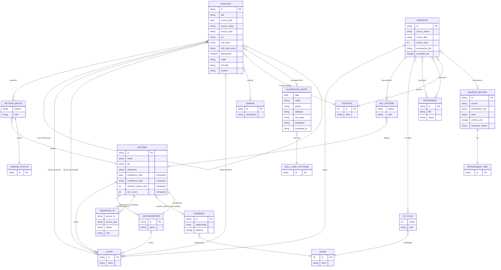

# Data Model

## Key relationships

- **ANALYSIS → PATTERN**: Many-to-many via `patterns_matched` (each match carries status, variant, note)
- **PRINCIPLE → PATTERN**: Many-to-many via `key_patterns` (same structure as analysis matches)
- **PATTERN.observed_in**: **Computed** — union of analysis matches + principle key_patterns
- **PATTERN.confidence**: **Computed** — from observed_in count vs. relevant corpus, using config thresholds
- **PATTERN.counter_evidence**: **Computed** — from evidence entries with `challenges`/`complicates` relationship
- **CIRCUMVENTION ↔ PATTERN**: Bidirectional — circumvention counteracts pattern(s); pattern lists its circumventions
- **PRINCIPLE → AXIOM**: IC-1 flags record when a source challenges an axiom's falsification condition
- **CALIBRATION_ENTRY → ANALYSIS**: Optional — when a SAMPLE mode read escalates to a full analysis
